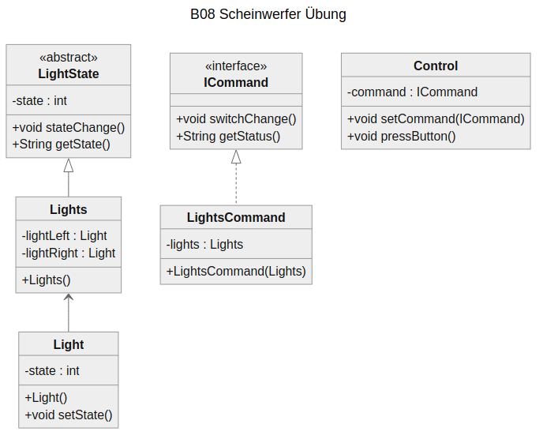

# B08 Scheinwerfer Übung

## Aufgabenstellung
Ein Auto hat zwei Scheinwerfer, die über einen Schalter gesteuert werden. Der Schalter sendet direkt ein Kommando an die beiden Scheinwerfer. Initial befindet sich der Schalter im Status S0 (Licht aus). Wird der Schalter im Status S0 gedrückt, wechselt der Status von S0 nach S1 (Parken). Wird der Schalter im Status S1 gedrückt, wechselt der Status von S1 nach S2 (Abblend-
licht). Wird der Schalter im Status S2 gedrückt, wechselt der Status von S2 nach S3 (Fernlicht).

Wird der Schalter im Status S3 gedrückt, wechselt der Status von S3 nach S0 (Licht aus).

**Patterns**: Sate, Command


## Class Diagramm

Klassendiagramm wurde text-orientierte durch Mermaid erstellt (https://mermaid.js.org/). Visual Paradigm ist unter meinem Linux Rechner nicht mehr lauffähig.



<br />
<br />

## Main.class

```java
public class Main {
    public static void main(String[] args) {
        Control control = new Control();

        var lights = new Lights();

        ICommand switchChange = new LightsCommand(lights);

        control.setCommand(switchChange);
        System.out.println(lights.getState());
        control.setCommand(switchChange);
        control.pressButton();
        System.out.println(lights.getState());
    }
}
```
